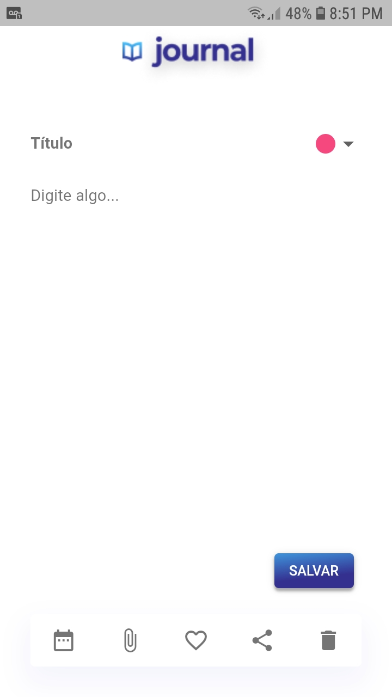
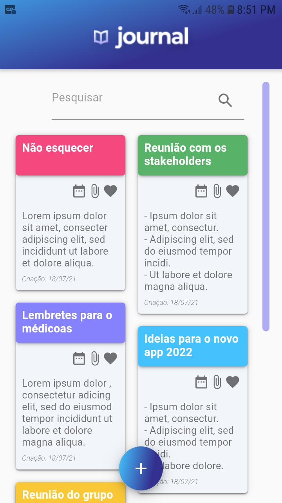

# #LevelUP4

O levelUP dessa semana consiste em dar sequencia ao nosso Notes! Mais especificamente a tela de visualização de notas.

## Features

- Componentização dos widgets
- Design correspondente com o Figma

## Resultado

Obs: As informações das notas são de uma lista estática.

    
    

## Pra Fazer

- Adicionar DatePicker
- Adicionar showDialog
- Adicionar package de Share
- Adicionar Anexar

## Packages Utilizados

- Intl
- StaggeredGridView
- AnimatedCard
